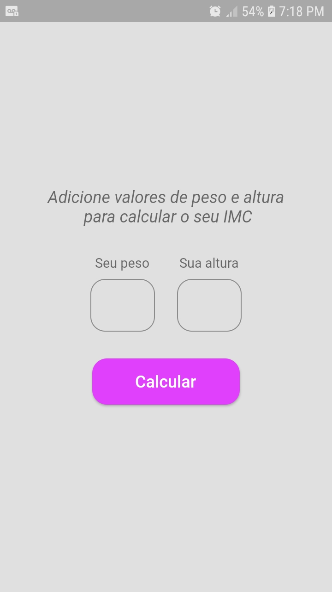
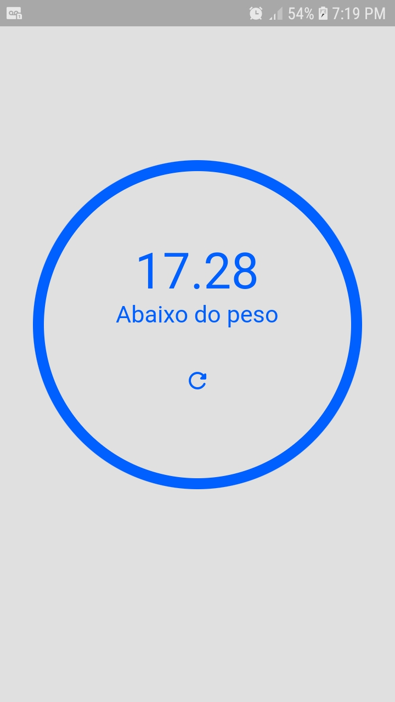
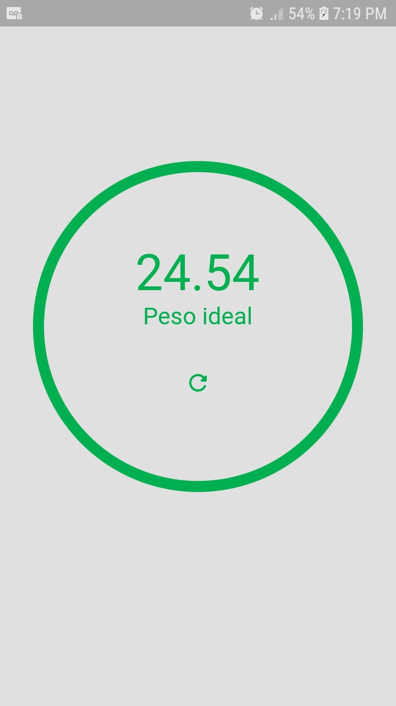
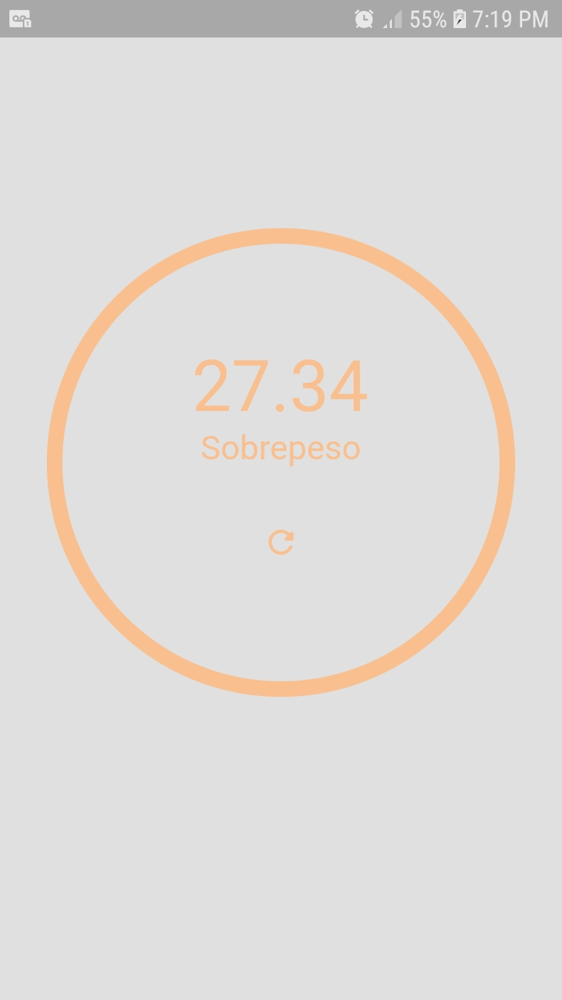
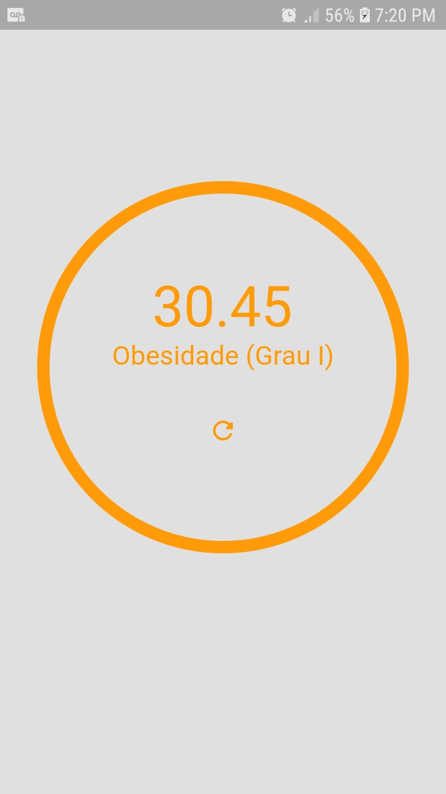
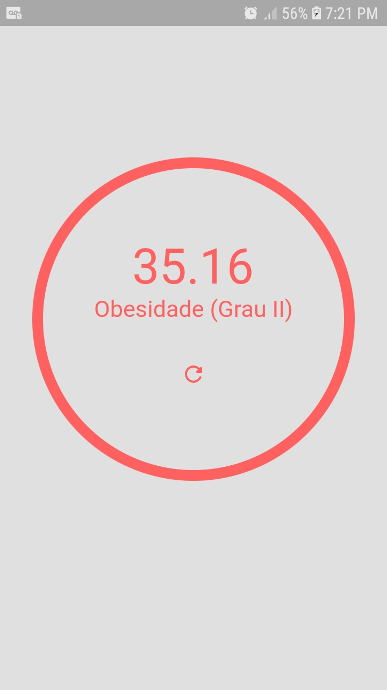
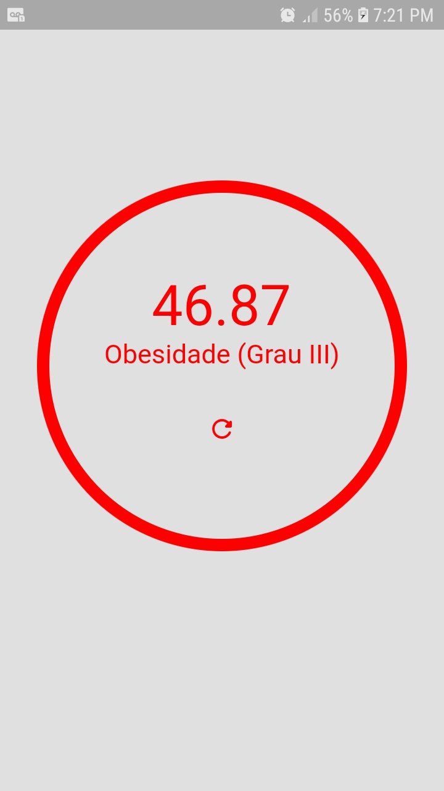

# IMC Calculator

Aplicativo básico que realiza o cálculo do índice de massa corporal e retorna para você se está ou não no peso ideal :)

## Resultado

<p float="left">



</p>
<p float="left">




</p>

## Tem interesse em saber o seu IMC?

Primeiro é necessário que vc tenha o flutter instalado na sua máquina.<br />
Caso ainda não tenha, siga os passos deste link: [Instalação Flutter](https://flutter.dev/docs/get-started/install)

Com o mesmo instalado, execute os comandos no seu terminal ou prompt:

```
git clone https://github.com/deivison-silva/imc_calculator.git
```

```
code imc_calculator
```

```
flutter pub get
```

```
flutter run
```
